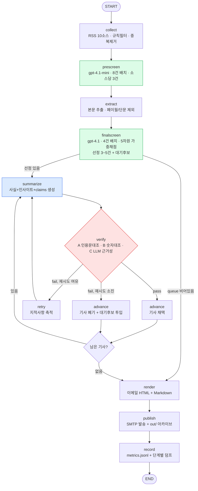

# 프로젝트 보고서 — 오늘의 기후 브리핑

환경·기후 분야 일간 뉴스레터 에이전트. 수집 → 선별 → 요약·인사이트 → 자동 검수 → 이메일 발행까지
LangGraph 한 그래프로 돌아간다.

| 항목 | 내용 |
|---|---|
| 분야 | 환경·기후 (정책 / 산업 / 국내 ESG) |
| 소스 | RSS **10개** (후보 22개를 실측해 12개 탈락) |
| 선별 | 예선(제목·요약, 8건 배치) → 본선(본문, 4건 배치) 2단계 |
| 검수 | 인용문 대조 · 숫자 대조 · LLM 근거성 판정 **3중**, 실패 시 재생성 → 폐기 → 대기 후보 교체 |
| 발행 | SMTP 이메일 + `out/` HTML·Markdown 아카이브 |
| 모델 | OpenAI `gpt-4.1-mini`(예선) / `gpt-4.1`(본선·요약·검수) |
| 1회 실행 | LLM 25회 호출, 78,434 토큰, 약 1분 50초 |

---

## 1. 분야 및 독자 정의

### 왜 환경·기후인가

과제에서 제외된 6개 소스가 전부 범용 AI 매체였다. 같은 AI 분야를 하면 남은 소스가
"제외된 매체를 받아쓰는 2차 매체"로 쏠린다. 환경·기후는 (1) 1차 자료를 직접 내는 기관이 많고
(정부·국제기구·학술지), (2) 국내 전문지와 해외 전문지가 서로 다른 소재를 다루며,
(3) 규제 일정이 실제로 기업 실무를 바꾸는 분야라 "독자에게 쓸모"라는 기준을 세우기 쉽다.

### 타깃 독자 페르소나

> **국내 중견·대기업 지속가능경영(ESG)·환경안전 담당 3~7년차 실무자**,
> 그리고 **기후테크 스타트업의 기획·사업개발 담당자**.
> 출근길 5분, 모바일 이메일로 읽는다.

| 구분 | 내용 |
|---|---|
| 이미 아는 것 | 기후변화의 실재, 탄소중립·RE100·CBAM 같은 용어의 기본 뜻, 작년까지의 국제 합의 흐름 → **개론 설명 불필요** |
| 필요한 것 | ① 내일 회의에서 인용할 새로운 사실·숫자 ② 규제·공시가 **언제부터 무엇을** 요구하는지 ③ 기술·시장이 파일럿인지 상용인지 ④ 위 내용의 **한국 기업 실무 함의** |
| 원하지 않는 것 | 개인 실천 팁, 기업 홍보성 보도자료, MOU·시상식 소식, 정치 공방, 감정 호소 |

이 정의는 전부 [`audience.yaml`](audience.yaml) 한 파일에 있고, 코드에는 기준을 하드코딩하지 않았다.
독자를 바꾸려면 YAML만 고치면 된다.

---

## 2. 소스 채택표

### 채택 기준 (사전에 정하고 실측으로 판정)

| 코드 | 기준 | 임계값 | 왜 이 기준인가 |
|---|---|---|---|
| C1 | 도달성 | HTTP 200 + 파싱 성공 + 엔트리 ≥ 1 | 매일 자동으로 도는 파이프라인이라 사람이 붙어 고칠 수 없다 |
| C2 | 공급량 | 최근 7일 기사 ≥ 5건 | **일간** 발행이므로 매일 새 소재가 나와야 한다 |
| C3 | 주제 적합 | 환경·기후 키워드 적중률 ≥ 0.60 | 종합지 전체 피드처럼 노이즈가 큰 소스는 예선 비용만 늘린다 |
| C4 | 본문 확보 | 추출 성공률 ≥ 0.60 **and** 길이 중앙값 ≥ 800자 | 검수가 **원문 대조**로 동작한다. 본문을 못 읽는 소스는 구조적으로 검수 불가 |
| C5 | 다양성 | 다른 후보와 제목 중복률 ≤ 0.30 | 같은 기사를 두 번 싣지 않기 위해 |
| C6 | 접근성 | 페이월 검출률 = 0 | 프리뷰만 읽고 요약하면 할루시네이션의 직접 원인이 된다 |

측정 스크립트: [`tools/source_probe.py`](tools/source_probe.py) · 원자료: [`store/source_audit.json`](store/source_audit.json)
· 전체 표: [`docs/source_audit.md`](docs/source_audit.md)
(후보별로 피드를 실제 호출하고, **기사 URL 3건의 본문까지 직접 받아** 추출 성공률을 쟀다.)

### 실측 결과 — 채택 10개

| 소스 | 구분 | 언어 | 최근7일 | 주제적합 | 본문성공 | 본문길이 | 판정 |
|---|---|---|---|---|---|---|---|
| 임팩트온 | 국내 ESG | ko | 50 | 0.94 | 0.67 | 1,787 | ✅ 채택 (가중 1.15) |
| 전기신문 | 국내 에너지 산업 | ko | 50 | 0.74 | 1.00 | 1,288 | ✅ 채택 |
| 뉴스펭귄 | 국내 기후·생태 | ko | 22 | 0.82 | 1.00 | 3,923 | ✅ 채택 (가중 1.05) |
| The Guardian Environment | 속보·종합 | en | 20 | 0.68 | 1.00 | 7,354 | ✅ 채택 (가중 0.95 — 노이즈 반영) |
| Canary Media | 산업·기술 | en | 16 | 0.94 | 1.00 | 14,397 | ✅ 채택 (가중 1.10) |
| Grist | 산업·사회 | en | 12 | 1.00 | 1.00 | 6,708 | ✅ 채택 |
| ScienceDaily Earth & Climate | 연구 | en | 9 | 0.73 | 1.00 | 7,473 | ✅ 채택 (가중 0.95) |
| Climate Home News | 정책·과학 | en | 8 | 1.00 | 1.00 | 10,789 | ✅ 채택 (가중 1.10) |
| Carbon Brief | 정책·과학 | en | 7 | 1.00 | 1.00 | 5,991 | ✅ 채택 (가중 1.15) |
| Yale Environment 360 | 심층·환경 | en | 5 | 0.74 | 1.00 | 2,382 | ✅ 채택 (C2 경계선) |

### 탈락 12개 — 전부 수치로 떨어뜨렸다

| 소스 | 측정값 | 위반 | 판단 |
|---|---|---|---|
| Phys.org Environment | 본문성공 **0.00**, 추출 57자 | C4 | 피드는 신선(30건/7일)했지만 본문을 안 준다. 검수 불가 |
| Inside Climate News | 본문성공 **0.00**, 추출 0자 | C4 | 크롤러 차단. 기사 품질과 무관하게 구조적으로 사용 불가 |
| Nature Climate Change | **페이월 0.33** (`preview of subscription content`) | C6 | 표본 3건 중 1건이 구독 프리뷰. 나머지는 초록뿐이라 실무 독자에게 가공 여지도 적다 |
| 환경부 보도자료 | 최근7일 **0건**(중앙연령 4,118h), 본문 0자 | C2·C4 | 가장 쓰고 싶었던 1차 소스인데 RSS가 사실상 멈춰 있다 |
| 그리니엄 | 최근7일 **0건** (중앙연령 6,058h ≈ 8개월) | C2 | 피드 갱신 중단. `/feed/`·`/rss`·`?feed=rss2` 3개 URL 모두 동일 |
| UNEP | 중앙연령 **25,997h** (≈3년), 본문성공 0.33 | C2·C4 | 피드 방치 |
| 한겨레 환경 | 환경 전용 피드 404 → 전체 피드 대체 시 **주제적합 0.03** | C2·C3 | 종합 피드를 받으면 환경 기사가 3%뿐이라 예선 비용만 늘어난다 |
| Heatmap News | 404 (`/feed`, `/rss.xml`, `/feed.xml` **3개 모두**) | C1 | 대체 URL까지 확인 후 탈락 |
| NOAA Climate.gov | 404 (대체 URL 2개도 404) | C1 | |
| EurekAlert! Earth Science | 404 (대체 URL 2개도 404) | C1 | |
| US EPA News Releases | **405** Method Not Allowed | C1 | 봇 차단 |
| DeSmog | **403** Forbidden | C1 | 봇 차단 |

> 검증 과정에서 실제로 기준을 한 번 고쳤다. 첫 페이월 판정에서 Climate Home News 가
> `paywall_rate 1.0` 으로 나왔는데, 확인해 보니 본문 17,992자가 멀쩡히 있고 하단 뉴스레터 CTA 문구
> `create a free account` 에 걸린 오탐이었다. 그래서 **"마커 문구 + 본문 3,500자 미만"** 을 동시에 만족할
> 때만 페이월로 보도록 고쳤고, 재측정에서 Climate Home 은 0.0, Nature 만 0.33 으로 남았다.
> ([`tools/source_probe.py:is_paywalled`](tools/source_probe.py))

### 커버리지 점검

채택 10개는 **국내 3 / 해외 7**, 성격으로는 정책·과학 2, 산업 3, 연구 1, 국내 ESG·에너지·생태 3,
속보 1로 나뉜다. 실제 실행에서 예선 통과 12건이 7개 소스에서 나왔다(아래 4장 로그).

---

## 3. 선별 로직 설계

### 3.1 중요도 판단 문장

선별 프롬프트에 그대로 주입되는 문장은 하나다 ([`audience.yaml`](audience.yaml)).

> 이 기사가 **"국내 ESG 실무자가 내일 업무 판단을 바꾸는 데 도움이 되는가"** 를 기준으로 판단하라.
> 기후 이슈 자체의 도덕적 중요성이 아니라, **독자의 의사결정에 들어가는 정보량**으로 평가한다.
> 같은 사건이라도 '발표가 있었다'는 속보보다 **'무엇이 언제부터 어떻게 바뀐다'** 는 기사가 높다.

두 번째 문장이 핵심이다. 이걸 빼면 LLM 은 "빙하가 녹는다" 류의 기사에 만점을 준다. 중요한 뉴스와
**이 독자에게** 쓸모 있는 뉴스는 다르다.

### 3.2 4단 필터 구조

```
232건  ─[규칙 필터]→  79건  ─[예선 LLM]→  12건  ─[본문 확보]→  11건  ─[본선 LLM]→  5건
        비용 0, 결정적       cheap 모델        HTTP           smart 모델
```

| 단계 | 방식 | 무엇을 거르나 | 실측 (2026-09-15 run) |
|---|---|---|---|
| 규칙 필터 | 코드 | 48시간 초과 / 날짜 없음 / 제목 블록리스트 / URL·제목 중복 | 232 → 79 (**153건 탈락, 전부 `rule:stale`**) |
| 예선 | `gpt-4.1-mini`, 8건 배치 | 독자 무관·홍보성 기사 | 79 → 41건이 4점 이상 → 소스당 3건 상한으로 **12건** |
| 본문 확보 | HTTP + 추출 | 본문 600자 미만·페이월 | 12 → 11 (`too_short(437<600)` 1건 탈락) |
| 본선 | `gpt-4.1`, 4건 배치 | 5개 차원 가중 채점 후 하한 미달 | 11 → **5건** (소스당 2건 상한) |

가장 비싼 판단(본문을 읽는 `gpt-4.1`)을 가장 마지막, 가장 적은 건수에 쓰는 게 이 구조의 목적이다.
79건을 전부 본선 방식으로 채점하면 토큰이 약 15배 든다.

### 3.3 본선 채점 차원과 가중치

| 차원 | 가중치 | 질문 |
|---|---|---|
| actionability | **0.30** | 독자가 업무에서 참고·인용·대응할 구체성이 있는가 |
| impact | 0.25 | 영향 범위와 규모가 국가·산업 단위인가 |
| novelty | 0.20 | 오늘 처음 알려진 사실인가 |
| evidence | 0.15 | 수치·1차 자료·공식 발표가 기사 안에 있는가 |
| korea_relevance | 0.10 | 한국 기업·정책·시장과 직접 연결되는가 |

가중 총점(0~10)에 **소스 가중치**(0.95~1.15)를 곱한다. 1차 자료 인용이 촘촘한 Carbon Brief 를 올리고,
주제적합률 0.68로 노이즈가 섞인 Guardian 을 내리는 용도다.
하한 `min_weighted: 5.0` 을 두어, **후보가 부실한 날은 3건을 못 채우더라도 싣지 않는다.**

### 3.4 배치 크기를 8 / 4 로 정한 이유 (실측)

"한 번에 몇 건씩 넣을까"를 감으로 정하지 않으려고 같은 후보 79건을 배치 크기만 바꿔 4번 채점했다
([`tools/batch_experiment.py`](tools/batch_experiment.py) · [`store/batch_experiment.json`](store/batch_experiment.json)).

| batch | 호출 수 | 토큰 | 소요 | 응답 누락 | 상위12 일치(vs 4) | 평균 점수차(vs 4) |
|---|---|---|---|---|---|---|
| 4 | 20 | 33,022 | 55.1s | 0 | 1.00 | 0 |
| **8** | **10** | **26,983** | **38.6s** | **2** | 0.50 | 0.81 |
| 12 | 7 | 25,292 | 38.9s | 0 | 0.60 | 0.81 |
| 16 | 5 | 23,751 | 38.7s | 0 | 0.71 | 1.03 |

읽은 것:

1. **절감은 8에서 거의 포화된다.** 4→8 에서 토큰 18%·시간 30% 가 줄지만, 8→12→16 은 각각 6% 남짓이다.
   더 키워봐야 얻는 게 별로 없다.
2. **배치를 키우면 LLM 이 일부 기사를 빼먹는다.** batch=8 에서 79건 중 2건의 `idx` 가 응답에서 누락됐다
   (이번 표본에서는 12·16 에서 0건이라 단조 증가는 아니다. 한 번 측정이라 노이즈가 크다).
   그래서 누락을 **조용히 버리지 않고** `min_score` 를 부여해 본선으로 올려 본문으로 다시 판단하게 했다
   ([`nl/screen.py`](nl/screen.py) 의 "보류 통과").
3. **어떤 배치 크기도 순위를 그대로 보존하지 못한다** (상위12 일치 0.50~0.71). 예선 점수는 원래
   흔들린다는 뜻이고, 이것이 **예선을 느슨하게(4점 이상 전부 통과) 잡고 본선에서 본문으로 다시 거르는**
   2단계 구조를 쓰는 진짜 이유다. 예선 하나로 3건을 뽑았다면 이 흔들림이 그대로 발행물에 실린다.

본선을 4로 둔 것은 본문 5,000자가 들어가 배치당 프롬프트가 예선의 8~10배이기 때문이다.
실측에서 본선 3회 호출에 19,965 토큰(호출당 ≈6.7k)이 들었는데, 8건씩 묶으면 한 호출이 4만 토큰을
넘어 응답 품질과 실패 시 손실이 모두 커진다.

### 3.5 소스 독식 방지 — 1차 실행에서 발견해 넣은 규칙

첫 실행에서 **선정 5건이 전부 임팩트온** 한 곳에서 나왔다. 기준상으로는 정상 동작이었다
(ESG 전문지라 페르소나 적합도가 압도적, 예선 평균 6.9점 vs Guardian 1.5점). 하지만 그건
뉴스레터가 아니라 한 매체의 요약본이다. 그래서 두 곳에 상한을 넣었다.

- 예선 → 본선: 소스당 최대 **3건** (`prescreen.max_per_source`)
- 본선 → 선정: 소스당 최대 **2건** (`finalscreen.max_per_source`), 최소 건수를 못 채우면 상한 해제

적용 전후 (같은 날 같은 소스, 코드만 변경):

| | 예선 통과 12건의 소스 분포 | 최종 선정 5건 |
|---|---|---|
| 적용 전 | impacton 10, electimes 2 | **impacton 5** |
| 적용 후 | impacton 3, electimes 3, newspenguin 2, canary 1, guardian 1, carbonbrief 1, grist 1 | 뉴스펭귄 1, 임팩트온 2, Guardian 1, 전기신문 1 |

### 3.6 기준이 동작했다는 증거

모든 실행이 단계별 덤프를 남긴다 (`store/runs/<run_id>/`). 샘플: [`docs/sample_run/`](docs/sample_run/)

| 파일 | 내용 |
|---|---|
| `01_collected.json` | 수집 232건 전부 + **버린 153건의 `drop_reason`** (`rule:stale(73.2h>48h)` 처럼 수치까지) |
| `02_prescreen.json` | 79건 전부의 예선 점수 · 라벨(`policy`/`korea`/`corporate`…) · 한 줄 사유 |
| `03_bodies.json` | 본문 확보 성공/실패와 실패 사유(`too_short(437<600)`) |
| `04_finalscreen.json` | 11건의 **차원별 점수**, 가중 총점, keep/drop, 편집장 사유 |
| `05_articles.json` | 발행 기사와 검수 결과, 탈락 기사와 탈락 사유 |
| `06_metrics.json`, `run.log` | 지표 요약과 전체 로그 |

실제 라벨링이 의도대로 갔는지 보여주는 예 (`02_prescreen.json`):

| 점수 | 라벨 | 소스 · 제목 | LLM 이 남긴 사유 (원문 그대로) |
|---|---|---|---|
| **9** | `policy` `market` | 임팩트온 · EU, 알루미늄 CBAM 면제 기준 50톤→5톤 추진 | "국내 수출입 기업의 CBAM 대응에 중대한 영향을 준다" |
| **9** | `policy` `korea` | 임팩트온 · 신한금융, 전환위험 34조원 공개 | "국내 ESG 공시 의무화 로드맵과 KSSB 기후공시 기준 대응 현황, 실무자가 참고할 구체적 데이터 제공" |
| **8** | `policy` | 임팩트온 · 美 EPA, 발전소 탄소규제 대부분 폐지 | "한국 기업의 미국 시장 진출 및 대응 전략에 영향" |
| **1** | `science` | 뉴스펭귄 · 남극 밑바닥, 천년 동안 썩지 않은 '펭귄 미라' | "ESG 실무 판단에 직접적 정책·기술 정보 부족" |
| **1** | `opinion` | The Guardian · Think of the parable of a frog in boiling water… | "기후 변화 심각성에 대한 감정적 호소 중심으로, 실무 판단에 구체적 정보 부족" |
| **0** | `lifestyle` | The Guardian · A job that changed me: Working the pool kiosk… | "개인 경험담으로 ESG 실무 판단에 무관함" |
| **0** | – | 전기신문 · 세븐나이츠 리버스, '귀멸의 칼날' 콜라보 사전등록 | "게임 콜라보 이벤트 내용으로 ESG 실무자 업무에 도움이 되지 않음" |

마지막 두 줄이 `audience.yaml` 의 제외 규칙(라이프스타일 기사 / 주제 무관)이 라벨과 함께 그대로
동작한 지점이다. 전기신문 RSS 는 전체 기사 피드라 게임 기사까지 들어오는데, 규칙 필터가 아니라
예선 LLM 이 0점으로 떨어뜨렸다.

소스별 예선 평균 점수도 페르소나 정의와 일치한다.

| 소스 | 임팩트온 | 전기신문 | Carbon Brief | Grist | Canary | 뉴스펭귄 | ScienceDaily | Guardian | Yale E360 |
|---|---|---|---|---|---|---|---|---|---|
| 평균 | **6.7** | 4.5 | 4.0 | 3.5 | 3.2 | 3.2 | 2.4 | **1.7** | 1.0 |

ESG 전문지가 가장 높고 종합지 환경섹션이 가장 낮다. **"기후 뉴스로서 중요"와 "이 독자에게 유용"을
실제로 구분하고 있다는 뜻이다.** (동시에 이것이 3.5절의 소스 독식 문제를 만든 원인이기도 하다.)

---

## 4. 요약 · 인사이트 · 자동 검수

### 4.1 요약이 단순 요약이 아니게 만드는 장치

기사마다 4개 필드를 만든다.

| 필드 | 성격 | 예시 (2026-09-15 발행분) |
|---|---|---|
| `what_happened` | 사실 | "유럽연합이 알루미늄 CBAM 면제 기준을 연 50톤에서 5톤으로 낮추는 방안을 논의 중입니다." |
| `why_it_matters` | **독자 관점 해석** | "면제선이 5톤으로 낮아지면 소규모 수입까지 CBAM 적용 대상이 확대될 수 있습니다. 이에 따라 한국산 기계·가전 등 주요 수출품에도 내재배출량과 검증자료 요구가 늘어날 가능성이 있습니다." |
| `reader_takeaway` | **행동** | "알루미늄 및 하류제품 수출 시 CBAM 적용 대상과 내재배출량 자료 요구 확대 여부를 점검하시기 바랍니다." |
| `claims[]` | **검증 재료** | 요약에 쓴 사실 3~5개 + 각각의 **원문 인용문** |

`claims` 가 이 설계의 핵심이다. 요약 모델에게 "네가 쓴 문장의 근거를 원문에서 그대로 복사해 오라"고
시키면, 검수기는 그 인용문이 원문에 실제로 있는지 **문자열 대조만으로** 확인할 수 있다.
할루시네이션을 LLM 판단에만 맡기지 않는 값싼 1차 방어선이다.

### 4.2 3중 검수 ([`nl/verify.py`](nl/verify.py))

| 층 | 방식 | 비용 | 잡는 것 |
|---|---|---|---|
| A. 인용문 대조 | 규칙 (정규화 후 부분 문자열) | 0 | 존재하지 않는 인용·발언 날조 |
| B. 숫자 대조 | 규칙 (2자리 이상 숫자 집합 비교) | 0 | 수치 왜곡, 단위 환산, 반올림 |
| C. 근거성 판정 | LLM (원문만 주고 claim별 supported/partial/unsupported) | 1회 | 과장, 범위 확대, 인과 비약 |

통과 조건: **A·B 위반 0건 AND `overall == pass` AND unsupported 0건 AND 근거 확인율 1.0**

### 4.3 검수가 실제로 잡는지 — 자체 테스트

"검수를 붙였다"는 말은 증거가 아니라서, 정상 요약 1건에 고의로 오류를 심은 변형 3건을
같은 검수기에 통과시켰다 ([`tools/verify_selftest.py`](tools/verify_selftest.py) ·
[`store/verify_selftest.json`](store/verify_selftest.json)).

| 케이스 | 조작 내용 | 기대 | 실제 | 검출한 층 |
|---|---|---|---|---|
| M0 원본 | 없음 | PASS | **PASS** | – (근거 5/5) |
| M1 숫자 조작 | 본문에 없는 수치 `4827` 삽입 | FAIL | **FAIL** | B 숫자대조, C 근거성 |
| M2 인용문 위조 | `claims[0].quote` 를 창작 문장으로 교체 | FAIL | **FAIL** | A 인용문대조 |
| M3 사실 날조 | "정부는 2035년까지 예산 3배 확정" 주장 추가 | FAIL | **FAIL** | A, B, C 전부 |

**4/4 기대대로.** 정상 요약을 잘못 떨어뜨리지도(M0), 조작을 놓치지도(M1~M3) 않았다.

### 4.4 실제 운영에서 걸린 사례

2026-09-15 실행에서 Guardian 기사 요약이 1차 검수에서 **실패**했다.

```
[11:51:45] 6/8 검수 실패 | 근거 4/5 (partial 1, unsupported 0) | 미확인 인용 0 | 미확인 숫자 0
    - Claim 0에서 'PFAS 생산이 급증하고 있다'는 표현은 원문에서 확인되지 않으며,
      실제로는 '생산 확대 계획'이 대부분임.
    - 요약문에서 '급증'이라는 단어 사용이 원문보다 과장됨.
[11:51:45]   → 재생성 시도 1/2
[11:51:49] 6/8 검수 통과 | 근거 5/5 (partial 0, unsupported 0)
```

숫자도 인용문도 멀쩡했고 **규칙 검수(A·B)는 통과했다.** "계획"을 "급증"으로 바꿔 쓴 어감 과장은
C층(LLM 근거성 판정)만 잡을 수 있는 종류다. 3중으로 쌓은 이유가 이 한 줄에 있다.
지적사항을 프롬프트에 붙여 재생성한 결과 4초 만에 통과했고, 최종 발행물에는 정확해진 문장이 실렸다.

### 4.5 예외 처리 — 어디서 죽어도 레터는 나간다

| 실패 지점 | 대응 | 구현 |
|---|---|---|
| 소스 1개 다운 | 해당 소스만 건너뛰고 나머지로 진행, 로그·metrics 에 기록 | `collect._fetch_one` 이 예외를 밖으로 내지 않음 |
| 예선 배치 실패 | 해당 배치를 **보류 점수**로 본선에 올림 (조용히 버리지 않음) | `screen.prescreen` |
| 본선 배치 실패 | 해당 배치만 제외, 나머지로 선정 | `screen.finalscreen` |
| 본문 확보 실패 | 그 기사만 제외 (본문 없이는 검수 불가) | `extract.fetch_bodies` |
| 요약 LLM 실패 | 3회 지수 백오프 후 검수 실패로 처리 → 재생성 경로 | `llm.chat_json`, `graph.node_summarize` |
| **검수 실패** | **지적사항 붙여 재생성 ×2 → 그래도 실패면 기사 폐기** | `graph.route_after_verify` |
| 폐기로 최소 건수 미달 | **대기 후보(backups)에서 다음 순위 기사를 투입**해 본문 수집부터 다시 | `graph.node_advance` |
| 검수 LLM 자체가 죽음 | 규칙 검수(A·B)만으로 보수적 판정 | `verify.verify` 의 `llm_error` 분기 |
| 통과 기사 0건 | **메일을 보내지 않는다.** 빈 레터 발송 금지, exit code 1 | `graph.node_publish`, `run.py` |
| SMTP 실패 | 로컬 HTML/MD 사본은 반드시 저장, 상태를 metrics 에 기록, exit code 3 | `publish.send_email` |

---

## 5. 파이프라인 구조도



### 상태(State) 흐름

`graph.py` 의 `State` 는 TypedDict 하나이고, 노드는 **바뀐 키만** 돌려준다.

| 노드 | 읽는 키 | 쓰는 키 |
|---|---|---|
| collect | `sources`, `audience.exclude` | `collected`, `dropped_rules`, `source_status` |
| prescreen | `collected` | `prescreened`, `finalists` |
| extract | `finalists` | `finalists`(본문 포함), `body_failed` |
| finalscreen | `finalists` | `scored`, `selected`, `backups`, **`queue`**, `cursor` |
| summarize | `queue[cursor]`, `last_verify`(재생성 시) | `draft`, `n_regenerated` |
| verify | `draft`, `queue[cursor]` | `last_verify` |
| retry | `attempts` | `attempts+1` |
| advance | `last_verify`, `draft`, `backups` | `articles` 또는 `rejected`, `cursor+1`, `queue`(후보 투입) |
| render / publish / record | `articles` | `html`, `markdown`, `files`, `publish_result`, `metrics` |

요약 루프의 커서는 `cursor`, 재시도 횟수는 `attempts` 로 관리한다. `advance` 가 `attempts` 를 0으로
되돌리므로 기사마다 재시도 예산이 독립적이다. 대기 후보 투입 시 `queue` 가 길어지므로
`route_after_advance` 는 매번 `cursor < len(queue)` 를 다시 본다.

---

## 6. 실행 기록

### 6.1 실행 로그 (run_id `20260915-115007`)

```
=== run_id 20260915-115007 / 오늘의 기후 브리핑 ===
[11:50:07] 1/8 수집 시작
[11:50:13]   소스 10/10 응답, 원본 232건 → 규칙 필터 통과 79건 (탈락 153건)
[11:50:13] 2/8 예선: 79건을 8건씩 채점
[11:50:59]   41건이 4점 이상 → 소스당 최대 3건으로 상위 12건 본선행
             (impacton:3, electimes:3, newspenguin:2, canary:1, guardian_env:1, carbonbrief:1, grist:1) (46.0s)
[11:50:59] 3/8 본문 수집: 12건
[11:51:04]   ! 본문 실패(too_short(437<600)): EU ETS 개편 초안, 배출권 수입 75% 산업 탈탄소 재투자…
[11:51:04]   본문 확보 11건 / 실패 1건
[11:51:04] 4/8 본선: 11건을 4건씩 본문 채점
[11:51:20]   선정  9.97 | 뉴스펭귄     | "느슨한 정부규제, 고탄소 업종 '태만' 불렀다"
[11:51:20]   선정  9.83 | 임팩트온     | 【공시 모니터링】신한금융, 전환위험 34조원ㆍ물리적 위험 담보 11.7조원 공개
[11:51:20]   선정  9.14 | 임팩트온     | EU, 알루미늄 CBAM 면제 기준 50톤→5톤 추진…소량 수입도 대상
[11:51:20]   선정  7.08 | The Guardian | 'Tidal wave' of Pfas being launched to satisfy AI
[11:51:20]   선정   6.8 | 전기신문     | AI 데이터센터, 얼마나 쓰느냐보다 어떻게 쓰느냐
[11:51:20]   선정 5건 / 대기 후보 2건
[11:51:20] 5/8 요약 [1/5] …
[11:51:26] 6/8 검수 통과 | 근거 5/5 (partial 0, unsupported 0) | 미확인 인용 0 | 미확인 숫자 0
             … (중략, 4.4절에 검수 실패→재생성 사례) …
[11:51:55] 7/8 렌더링: 기사 5건
[11:51:55] 8/8 발행 …
[11:51:55] 기록 완료 → store/metrics.jsonl, store/runs/20260915-115007/

--- 요약 ---
수집 232 → 규칙통과 79 → 본선 5 → 발행 5건 (검수탈락 0, 재생성 1회)
LLM 호출 25회 / 78,434 토큰
```

### 6.2 발행 결과물


원본: [`out/2026-09-15.html`](out/2026-09-15.html) · [`out/2026-09-15.md`](out/2026-09-15.md)

레터 하단에 그날의 파이프라인 수치(수집 → 필터 → 예선 → 본선 → 검수)를 그대로 적어,
독자가 "이 5건이 몇 건 중에서 나왔는지"를 볼 수 있게 했다.

### 6.3 메일 발송

<!-- SMTP 설정 후 실제 수신함 캡처를 여기에 넣는다 -->
_(SMTP 설정 후 채움)_

### 6.4 누적 지표 (`store/metrics.jsonl`)

| run_id | 수집 | 규칙통과 | 본선 | 발행 | 재생성 | 검수통과율 | LLM 호출 | 토큰 |
|---|---|---|---|---|---|---|---|---|
| 20260915-114659 | 232 | 79 | 5 | 5 | 0 | 1.00 | 22 | 65,054 |
| 20260915-115007 | 232 | 79 | 5 | 5 | 1 | 1.00 | 25 | 78,434 |

단계별 비용 분해 (두 번째 실행):

| 단계 | 호출 | 토큰 | 시간 |
|---|---|---|---|
| prescreen (mini) | 10 | 27,087 | 46.0s |
| finalscreen (4.1) | 3 | 19,965 | 16.1s |
| summarize (4.1) | 6 | 16,307 | 17.9s |
| verify (4.1) | 6 | 15,075 | 17.0s |

호출 수는 예선이 가장 많지만(10/25), 값싼 모델을 써서 토큰 단가 기준 비용은 본선 이후가 더 크다.
2단계 구조의 의도대로다.

---

## 7. 프로젝트 회고

### 가장 공들인 부분

**1. 소스를 고른 게 아니라 측정했다.**
후보 22개를 전부 실제로 호출하고, 피드뿐 아니라 **기사 본문까지 3건씩 받아** 추출 성공률을 쟀다.
이 과정이 없었다면 Phys.org(신선도 30건/7일, 주제적합 0.93)와 Inside Climate News(탐사보도 명가)를
당연히 채택했을 것이다. 둘 다 본문 추출률이 0.00 이라 **검수가 구조적으로 불가능한** 소스였다.
"좋은 매체"와 "이 파이프라인이 쓸 수 있는 매체"는 다르다는 걸 숫자가 알려줬다.

**2. 검수를 LLM 하나에 맡기지 않았다.**
요약 모델에게 claims + 원문 인용문을 함께 내게 만든 것이 설계의 분기점이었다. 덕분에 인용문·숫자
대조라는 **비용 0의 결정적 검사**를 앞에 세울 수 있었다. 자체 테스트 4케이스에서 조작 3건이 모두
걸렸고, 실제 운영에서는 규칙 검수를 통과한 어감 과장("계획"→"급증")을 LLM 층이 잡아 재생성으로
이어졌다. 층마다 잡는 오류 종류가 다르다는 게 로그로 확인됐다.

**3. 문제를 발견하고 규칙을 되돌려 고쳤다.**
1차 실행에서 선정 5건이 전부 한 매체였던 것, Climate Home 페이월 오탐, 배치 크기를 감으로 정한 것 —
셋 다 "돌아가긴 하는데 이상한" 상태였고, 각각 소스 상한 규칙 / 길이 조건 병행 / 실측 실험으로
고쳤다. 결과보다 이 되돌아간 과정이 프로젝트의 실질이었다.

### 아쉬운 점 · 보완하고 싶은 것

**1. 국내 1차 소스를 못 넣었다.** 환경부 보도자료는 RSS가 사실상 멈춰 있어(최근 7일 0건) 탈락했다.
실무 독자에게는 국내 규제 원문이 가장 가치가 높은데, 지금은 임팩트온 같은 2차 매체를 통해 간접적으로만
들어온다. RSS 대신 게시판 목록 페이지를 파싱하는 수집기를 따로 붙여야 한다.

**2. 배치 실험이 1회 측정이다.** batch=8 에서 응답 누락 2건이 나왔지만 12·16 에서는 0건이었다.
표본이 한 번뿐이라 노이즈와 구분되지 않는다. 같은 설정을 3~5회 반복해 평균과 분산을 봐야
"8이 최적"이라고 말할 수 있다. 지금은 "8~12 구간에서 절감이 포화한다"까지만 근거가 있다.

**3. 선별 품질을 평가할 정답 세트가 없다.** LLM 점수가 페르소나와 일치하는 방향으로 움직인다는 건
소스별 평균 점수로 확인했지만, "이 5건이 그날의 최선이었는가"는 아무도 검증하지 않았다.
직접 30~50건에 라벨을 달아 고정 평가셋을 만들고, 프롬프트를 바꿀 때마다 재현율을 재는 게 다음 순서다.

**4. 중복 판정이 제목 기준이다.** 서로 다른 매체가 같은 사건을 다른 제목으로 쓰면 지금 구조로는
못 잡는다. 임베딩 유사도로 사건 단위 클러스터링을 하면 "같은 사건, 다른 시각" 을 묶어
한 꼭지로 낼 수도 있다.

**5. 개인화·피드백 루프가 없다.** 지금은 매일 같은 기준으로 돈다. 독자가 어떤 꼭지를 클릭했는지
같은 신호가 `audience.yaml` 의 가중치로 되먹임되면 진짜 "나만의" 뉴스레터가 된다.

---

## 부록: 재현 방법

```bash
pip install -r requirements.txt
cp .env.example .env          # OPENAI_API_KEY, SMTP 정보 입력
python tools/source_probe.py  # 소스 실측 (2장 표 재생성)
python run.py --dry-run       # 메일 없이 전체 파이프라인
python tools/verify_selftest.py   # 검수 자체 테스트 (4.3절)
python tools/batch_experiment.py  # 배치 크기 실험 (3.4절)
python run.py                 # 실제 발행
```
