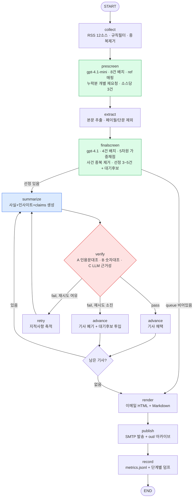
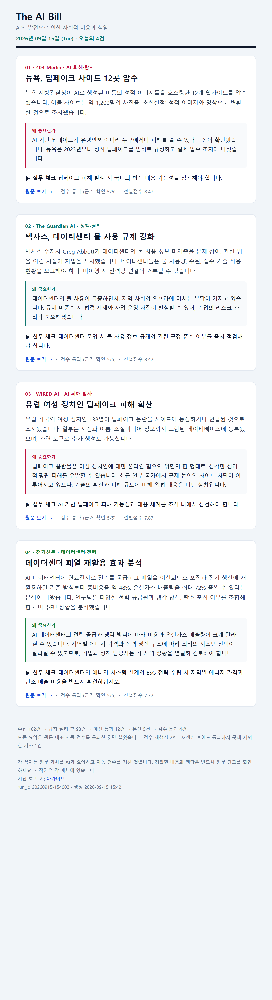
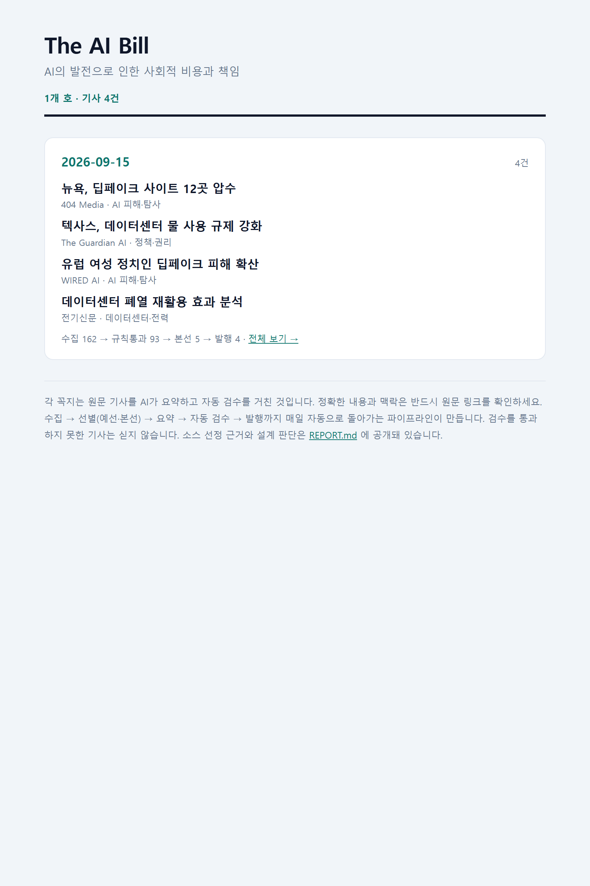

# 프로젝트 보고서 — The AI Bill

AI가 사회와 환경에 떠넘기는 비용을 매일 아침 추적하는 뉴스레터 에이전트.
수집 → 선별 → 요약·인사이트 → 자동 검수 → 발행까지 LangGraph 한 그래프로 돌아간다.

| 항목 | 내용 |
|---|---|
| 분야 | AI의 환경·인프라 부담 + AI가 만드는 사회적 피해 |
| 소스 | RSS **12개** (후보 35개를 실측해 23개 탈락) |
| 선별 | 규칙 필터 → 예선(제목·요약, 8건 배치) → 본문 확보 → 본선(본문, 4건 배치) |
| 검수 | 인용문 대조 · 숫자 대조 · LLM 근거성 판정 **3중**, 실패 시 재생성 → 폐기 → 대기 후보 교체 |
| 발행 | **공개 웹 아카이브**(GitHub Pages) + SMTP 이메일 + `out/` 로컬 사본 |
| 모델 | OpenAI `gpt-4.1-mini`(예선) / `gpt-4.1`(본선·요약·검수) |
| 1회 실행 | LLM 25회 호출, 67,298 토큰, 약 1분 50초 |

> 이 프로젝트는 처음에 **환경·기후** 주제로 만들어 완주한 뒤, 주제를 **AI×(환경+사회)** 로 옮겼다.
> 코드는 한 줄도 바꾸지 않고 `audience.yaml`·`sources.yaml` 두 파일만 교체해서 전환했다.
> 이전 주제의 실측 자료도 저장소에 남아 있다 ([docs/source_audit.md](docs/source_audit.md)).

---

## 1. 분야 및 독자 정의

### 왜 이 주제인가

과제 제외 목록 6개가 전부 범용 AI 매체였다. 그래서 "AI 산업 소식"이 아니라 **"AI가 남기는 청구서"**
로 각도를 틀었다. 이렇게 잡으면 세 가지가 생긴다.

1. 제외된 매체들이 잘 다루지 않는 영역이다. 데이터센터 전력·용수, 딥페이크 피해자 구제,
   AI 훈련 노동은 제품 발표 기사와 소스가 다르다.
2. **환경 축과 사회 축이 서로를 보완한다.** 한쪽이 조용한 날 다른 쪽이 채운다.
   실제로 두 주제를 따로 재보니 AI×환경 48시간 38건, AI×사회 51건으로, 합치면 공급 위험이 사라졌다.
3. "무엇이 실제로 청구됐는가"라는 기준이 서면 선별 기준을 숫자로 쓸 수 있다.

### 타깃 독자 페르소나

> **기업에서 AI 도입을 검토·관리하는 기획·법무·ESG·인사 담당자**,
> 그리고 **AI 정책·규제를 다루는 공공·연구 실무자**. 출근길 5분, 모바일로 읽는다.

| 구분 | 내용 |
|---|---|
| 이미 아는 것 | LLM이 무엇인지, 주요 모델·기업 이름, AI가 논쟁적이라는 사실 → **총론과 벤치마크 설명 불필요** |
| 필요한 것 | ① AI 도입·운영에서 실제로 터진 리스크(소송·규제 조치·사고) ② 전력·용수·요금이 누구에게 얼마나 전가되는지 ③ 노동·차별·안전 피해의 구체적 숫자 ④ 한국 규제·실무에 언제부터 닿는지 |
| 원하지 않는 것 | 모델 성능·신제품·투자 유치 발표, AI 활용 팁, 홍보성 보도자료, 정치 공방 |

정의는 전부 [`audience.yaml`](audience.yaml)에 있고 코드에는 기준을 하드코딩하지 않았다.

---

## 2. 소스 채택표

### 채택 기준

환경 주제에서 쓰던 6개 기준을 그대로 가져오되, **C2를 고치고 C7을 새로 넣었다.**

| 코드 | 기준 | 임계값 | 비고 |
|---|---|---|---|
| C1 | 도달성 | HTTP 200 + 파싱 + 엔트리 ≥ 1 | 그대로 |
| **C2′** | 주제 공급량 | **주력** 주제 기사 7일 ≥ 3건 / **전문** 7일 ≥ 1건 + 적중률 ≥ 0.10 | **변경** |
| C3 | 주제 적중률 | ≥ 0.10 | **완화** (환경 주제는 0.60이었다) |
| C4 | 본문 확보 | 성공률 ≥ 0.60 **and** 중앙 길이 ≥ 800자 | **양보 불가** — 검수가 원문 대조 |
| C5 | 다양성 | 제목 중복률 ≤ 0.30 | 그대로 |
| C6 | 접근성 | 페이월 검출 = 0 | **양보 불가** |
| **C7** | 표본 정밀도 | 매칭 헤드라인 표본의 절반 이상이 실제 주제 | **신설** |

**C2를 고친 이유.** 처음에는 소스마다 "7일 3건 이상"을 요구했다. 그 기준을 기계적으로 적용했더니
Latitude Media(1건)·Utility Dive(1건)·404 Media(2건)·Rest of World(2건)가 전부 탈락하면서
**AI×환경 축이 통째로 사라졌다.** 그런데 이 소스들의 표본 정밀도는 100%였다. 소스 하나를 유지하는
비용은 HTTP 요청 1회뿐이므로, 주 1건이라도 정확하면 넣는 게 이득이다. 일간 발행에 필요한 건
소스별 공급량이 아니라 **채택 소스 합계 공급량**이다(요구: 48시간 ≥ 15건, 실측 52건).

**C7을 넣은 이유.** 자동 적중률이 실제 정밀도와 어긋났다. 아래 두 사례가 결정적이었다.

| 소스 | 자동 적중률 | 표본 정밀도 | 실제 매칭된 헤드라인 |
|---|---|---|---|
| Grist | 0.15 (**통과**) | **0/3** | "Trump topples the last pillar of Biden's climate agenda" — AI가 없다 |
| Pluralistic | **1.00** (최고점) | **0/4** | 제목이 전부 "Pluralistic: …". 하루치 링크를 한 글에 모으는 링크블로그 |

키워드 교집합은 "AI와 환경 단어가 같은 기사에 있다"는 잡지만 "AI가 환경 문제를 일으킨다"는
못 잡는다. 사람이 헤드라인 표본을 한 번 보는 검사를 기준에 넣었다.

측정: [`tools/source_probe.py`](tools/source_probe.py) · 원자료: [`store/source_audit_ai.json`](store/source_audit_ai.json) ·
전체 표: [`docs/source_audit_ai.md`](docs/source_audit_ai.md)

### 채택 12개

| 등급 | 소스 | 축 | 주제7일 | 적중률 | 표본정밀 | 본문 | 가중 |
|---|---|---|---|---|---|---|---|
| 주력 | The Guardian AI | 정책·권리 | 10 | 0.50 | 3/4 | 5,287자 | 1.10 |
| 주력 | WIRED AI | AI 피해·탐사 | 6 | 0.60 | 4/4 | 5,242자 | 1.10 |
| 주력 | 디지털투데이 | 국내 테크 | 8 | 0.16 | 3/4 | 1,270자 | 1.10 |
| 주력 | 전기신문 | 데이터센터·전력 | 12 | 0.24 | 3/4 | 1,430자 | 1.05 |
| 주력 | 지디넷코리아 | 국내 테크 | 12 | 0.40 | 2/4 | 937자 | 0.95 |
| 주력 | 전자신문 | 국내 산업·노동 | 4 | 0.13 | 2/4 | 1,069자 | 0.95 |
| 전문 | Ars Technica AI | AI 피해·탐사 | 3 | 0.15 | **3/3** | 11,129자 | 1.10 |
| 전문 | 404 Media | AI 피해·탐사 | 2 | 0.13 | **2/2** | 6,346자 | 1.10 |
| 전문 | Rest of World | 글로벌 노동·불평등 | 2 | 0.33 | **4/4** | 7,501자 | 1.10 |
| 전문 | Latitude Media | 데이터센터·전력 | 1 | 0.10 | **1/1** | 4,293자 | 1.15 |
| 전문 | Utility Dive | 데이터센터·전력 | 1 | 0.10 | **1/1** | 4,776자 | 1.05 |
| 전문 | EFF Deeplinks | 정책·권리 | 4 | 0.36 | 2/4 | 3,431자 | 1.00 |

**국내 4 / 해외 8**, 환경 축 4 · 사회 축 6 · 교차 2. 합계 주제 기사 48시간 **52건**.

### 탈락 23개 — 유형별

| 유형 | 소스와 측정값 |
|---|---|
| **C4 본문 확보 실패** | **Data Center Dynamics** (0.00 / 0자 — 주제 전문지인데 크롤러 차단), NYT Technology (0.00 / 43자), Platformer (0.33 / 550자), 테크42 (0.50), Nieman Lab (0.00 / 460자) |
| **C6 페이월** | **임팩트온** (0.33) — 환경 주제에선 채택했는데 AI 기사가 유료 구간에 걸렸다 |
| **C7 정밀도** | Grist (0/3), Pluralistic (0/4, 구조적 부적합) |
| **C1 도달 실패** | AP News AI (403), **과기정통부 보도자료** (404, 대체 URL 3개 모두), **개인정보보호위원회** (404, 대체 URL 2개 모두) |
| **C2′·C3** | Carbon Brief(주제 0건), The Conversation(0건), The Register(0건), Schneier(0건), Import AI(7일 발행 0건), IEEE Spectrum(0건), Canary Media(2건·0.06), 블로터(0.06), 바이라인(0.10 경계), IT조선(0.12, 국내 4개 상한으로 예비), The Guardian Environment(1건·0.04), 뉴스펭귄(1건·본문 0.5) |

> **국내 1차 자료가 두 주제 연속 실패했다.** 환경 주제에서는 환경부 RSS가 5개월째 멈춰 있었고,
> 이번에는 과기정통부·개인정보보호위원회에 RSS 자체가 없다(각각 대체 URL 3개·2개를 시도했다).
> 규제 원문이 실무 독자에게 가장 가치가 높은데, RSS로는 닿을 수 없다는 게 반복 확인됐다.

---

## 3. 선별 로직 설계

### 3.1 중요도 판단 문장 — 한 번 크게 틀렸다

처음 쓴 문장은 이랬다.

> ~~이 기사가 "AI가 누구에게 어떤 **비용**을 떠넘기는지"를 새로 알려주는가로 판단하라.
> **비용의 크기(숫자), 부담 주체(누가), 시점(언제부터)**이 드러난 기사를 높게 본다.~~

경제 용어로만 써놓으니 LLM이 '비용'을 **인프라 비용으로만** 읽었다. 그 결과:

```
5.23 drop | 404 Media | New York Seizes 12 Celebrity Deepfake Websites
      "딥페이크 사이트 압수... 비용 전가·인프라 부담 등 본 뉴스레터 핵심 주제와 관련 없음"
7.77 keep | 전기신문   | 송전망 철탑 2214기 줄인다…정부, 선로 통합으로 주민 피해 최소화
      "송전망 건설로 인한 주민 피해와 비용 전가 구조가 구체적으로 제시됨"   ← AI 언급이 없다
```

**사회 축이 통째로 버려지고, AI와 무관한 전력 기사가 1면에 올라왔다.** 두 축을 명시하고
AI 연결을 필수 조건으로 박아 고쳤다.

> 이 기사가 "AI가 누구에게 어떤 **부담**을 떠넘기는지"를 새로 알려주는가로 판단하라.
> '부담'은 두 종류이고, 둘의 무게는 같다.
>   **(A) 환경·인프라 부담** : 데이터센터 전력·용수, 전기요금 인상, 배출, 계통 접속 비용
>   **(B) 사회적 피해** : 딥페이크·성착취물, 차별·편향, 일자리와 노동조건, 저작권, 개인정보·감시,
>       아동·청소년 안전, 사기, AI 오작동 피해
> **(B)를 (A)보다 낮게 보지 마라.** 딥페이크 피해자 구제나 규제 집행 기사는 이 뉴스레터의 정면 소재다.
>
> **[필수 조건]** AI·데이터센터·알고리즘이 그 부담의 원인이거나 핵심 맥락으로 기사 본문에 등장해야 한다.
> 전력·환경 기사라도 AI와의 연결이 없으면 아무리 중요해도 제외한다.

고친 직후 같은 날 같은 소스로 다시 돌리니 딥페이크 기사 3건이 상위로 올라오고 송전망 기사는
사라졌다. **프롬프트 한 문단이 선별 결과를 통째로 바꾼다**는 걸 로그로 확인한 지점이다.

### 3.2 4단 필터 구조

```
162건 ─[규칙]→ 89건 ─[예선 LLM]→ 12건 ─[본문확보]→ 12건 ─[본선 LLM]→ 5건
      비용 0        gpt-4.1-mini        HTTP           gpt-4.1
```

| 단계 | 방식 | 실측 (run `20260915-144111`) |
|---|---|---|
| 규칙 필터 | 코드 | 162 → 89 (**탈락 73건**: `rule:stale` 65, `rule:blocklist` 8) |
| 예선 | `gpt-4.1-mini`, 8건 배치 | 89건 중 **21건이 4점 이상** → 소스당 3건 상한으로 12건 (7개 소스) |
| 본문 확보 | HTTP + 추출 | 12 → **12** (실패 0건 — C4로 걸러낸 효과) |
| 본선 | `gpt-4.1`, 4건 배치 | 12 → **5건 선정 + 대기 후보 3건** |

가장 비싼 판단을 가장 적은 건수에 쓰는 게 목적이다. 단계별 실측 비용:

| 단계 | 호출 | 토큰 | 시간 |
|---|---|---|---|
| prescreen (mini) | 12 | 32,928 | 53.9s |
| finalscreen (4.1) | 3 | 15,269 | 16.2s |
| summarize (4.1) | 5 | 10,206 | 16.1s |
| verify (4.1) | 5 | 8,895 | 13.4s |

### 3.3 본선 채점 차원

| 차원 | 가중치 | 질문 |
|---|---|---|
| **burden_clarity** | **0.25** | AI가 떠넘긴 부담을 '누가' 떠안는지와 규모가 구체적인가. **환경 비용이든 사회적 피해든 동등하게 본다** |
| actionability | 0.25 | 도입 검토·리스크 점검·정책 대응에 바로 참고할 수 있는가 |
| impact | 0.20 | 개별 사례를 넘어 산업·국가 단위인가 |
| novelty | 0.20 | 오늘 처음 확인된 사실인가, 반복된 우려의 재진술인가 |
| korea_relevance | 0.10 | 한국 규제·기업·노동 시장과 직접 연결되는가 |

가중 총점에 **소스 가중치**(0.95~1.15)를 곱한다. 하한 `min_weighted: 5.0` 을 두어 후보가 부실한 날은
3건을 못 채우더라도 싣지 않는다.

### 3.4 배치 크기를 8 / 4 로 정한 이유 (실측)

같은 후보 집합을 배치 크기만 바꿔 4번 채점했다
([`tools/batch_experiment.py`](tools/batch_experiment.py) · [`store/batch_experiment.json`](store/batch_experiment.json)).
※ 이 측정은 주제 전환 전(환경·기후 후보 79건)에 수행했다.

| batch | 호출 수 | 토큰 | 소요 | 응답 누락 | 상위12 일치(vs 4) |
|---|---|---|---|---|---|
| 4 | 20 | 33,022 | 55.1s | 0 | 1.00 |
| **8** | **10** | **26,983** | **38.6s** | **2** | 0.50 |
| 12 | 7 | 25,292 | 38.9s | 0 | 0.60 |
| 16 | 5 | 23,751 | 38.7s | 0 | 0.71 |

1. **절감은 8에서 포화된다.** 4→8 에서 토큰 18%·시간 30%가 줄고, 그 뒤로는 6%씩이다.
2. **배치를 키우면 모델이 일부 기사를 빠뜨린다.** batch=8 에서 2건이 누락됐다
   (12·16에서 0건이라 단조 증가는 아니다. 1회 측정이라 노이즈가 크다).
3. **어떤 배치 크기도 순위를 보존하지 못한다**(상위12 일치 0.50~0.71). 예선 점수는 원래 흔들린다.
   이것이 **예선을 느슨하게 잡고 본선에서 본문으로 다시 거르는** 2단계 구조의 진짜 이유다.

본선을 4로 둔 것은 본문 5,000자가 들어가 배치당 프롬프트가 예선의 8~10배이기 때문이다.
실측에서 본선 3회에 15,269 토큰(호출당 ≈5.1k)이 들었다.

### 3.5 배치 응답 누락은 '누락'이 아니라 '오배치'였다 — 발견과 수정

주제를 옮긴 첫 실행에서 본선 결과가 이상했다.

```
8.64 keep | 404 Media    | New York Seizes 12 Celebrity Deepfake Websites
      사유: "텍사스 주지사가 데이터센터의 물 사용량 미신고에 대해..."   ← 다른 기사의 사유
0.00 drop | The Guardian | Texas governor threatens to penalize datacenters  ← "응답 누락"
```

12건 중 **6건이 응답 누락으로 0점** 처리됐고, 누락된 기사의 점수·사유가 **엉뚱한 기사에 붙었다.**
원인은 둘이었다.

1. 본선 프롬프트에 "모든 기사에 빠짐없이 응답하라"는 지시가 없었다 (예선 프롬프트에만 있었다).
2. 응답을 **배열 위치(idx)로 매핑**해서, 모델이 일부만 돌려주면 순번이 밀려 점수가 다른 기사에 붙었다.

즉 3.4절에서 "누락"으로만 봤던 현상이 실제로는 **선별 결과를 오염시키는 오배치**였다. 고친 내용:

- 기사마다 `ref` 식별자(`A0`…)를 붙이고 모델에게 그대로 복사하게 해서 **위치가 아닌 ref로 매핑**한다.
  모르는 ref와 중복 ref는 버린다.
- 누락된 기사는 **개별 재요청**으로 되찾는다.
- 두 프롬프트 모두에 완결성 지시를 넣었다.

고친 뒤 같은 입력에서 누락 0건이 됐고, 잘못 버려졌던 Texas 물 규제 기사가 제자리(상위권)로 돌아왔다.
([`nl/screen.py`](nl/screen.py) 의 `_by_ref`, `_run_batches`)

### 3.6 소스 독식 방지와 사건 중복 제거

**소스 상한** — 환경 주제 첫 실행에서 선정 5건이 전부 한 매체였다. 예선→본선 소스당 3건,
본선→선정 소스당 2건으로 상한을 걸었다.

**사건 중복** — AI 주제에서 새 문제가 나왔다. 같은 사건을 두 매체가 다르게 쓰면 둘 다 실린다.

```
8.63 | 404 Media | New York Seizes 12 Celebrity Deepfake Websites
8.63 | WIRED AI  | New York Seizes a Dozen Celebrity Deepfake Websites   ← 같은 사건
```

수집 단계 중복 판정(제목 토큰 자카드 ≥ 0.8)에 `12` vs `a Dozen` 차이로 0.75가 나와 통과했다.
후보가 12건뿐인 **선정 직전**에는 임계값을 0.6으로 낮춰도 안전하므로, 그 지점에 사건 중복 제거를
추가했다. 실행 로그에 남는다.

```
[14:30:01]   중복 사건 제외: WIRED AI | New York Seizes a Dozen Celebrity Deepfake W (← 404 Media 와 동일 사건)
```

### 3.7 규칙 기반 주제 게이트 — 넣었다가 되돌렸다

국내 종합 IT 피드의 예선 평균 점수가 디지털투데이 0.8 / 전자신문 0.8 / 지디넷 0.7이었다.
0점 기사가 "임시주주총회 소집 결의", "주식 보유 비율 변동", "게임 신작 공개" 같은 공시였고,
예선 토큰 32,928의 대부분이 여기 쓰였다. 그래서 LLM 이전에 키워드 교집합으로 거르는
**주제 게이트**를 넣었다.

| | 규칙 통과 | 예선 | 전체 | 발행 |
|---|---|---|---|---|
| 게이트 없음 | 95건 | 12회 34,928토큰 | 27회 71,293토큰 | 5건 |
| **게이트 적용** | **23건** | **3회 8,507토큰** | **18회 48,938토큰** | 5건 |

토큰은 31% 줄었다. 그런데 **버려진 목록을 보니 그날의 최상위 기사들이 들어 있었다.**

```
Texas governor threatens to penalize datacenters not obeying water laws   ← 직전 실행 1위
'Tidal wave' of Pfas being launched to satisfy AI industry
AI Agents Are Thirsty for Power
Inside 'Project Lily': The Humans Reading Your ChatGPT
```

원인은 내가 넣은 **영문 단어 경계**였다. env 키워드가 `water law` 인데 기사는 `water laws` 라
접미사 경계에 막혔고, `power` 는 단독 키워드가 아니었다. 짧은 영문 제목에서 두 키워드 그룹을
동시에 만족시키기는 원래 어렵다.

**되돌렸다.** 회당 수 센트를 아끼자고 1순위 기사를 잃는 건 손해다. 대신 위험이 0인 것만 남겼다:
`소유 주식`, `보유 비율`, `주주총회`, `자금 대여` 같은 **공시 패턴을 제목 블록리스트에 추가**했다
(이번 실행에서 8건 차단). 주제 판단은 예선 LLM에 맡긴다 — 실제로 LLM은 공시 기사에 0점과
"AI 부담과 무관함"이라는 사유를 정확히 달았다.
게이트 구현은 `nl/collect.py` 의 `TopicGate` 에 `enabled: false` 로 남겨뒀다.

### 3.8 기준이 동작했다는 증거

모든 실행이 단계별 덤프를 남긴다. 샘플: [`docs/sample_run/`](docs/sample_run/)

| 파일 | 내용 |
|---|---|
| `01_collected.json` | 수집 162건 전부 + **버린 73건의 `drop_reason`** (`rule:stale(73.2h>48h)` 처럼 수치까지) |
| `02_prescreen.json` | 89건 전부의 예선 점수·라벨·한 줄 사유 |
| `03_bodies.json` | 본문 확보 성공/실패와 실패 사유 |
| `04_finalscreen.json` | 12건의 **차원별 점수**, 가중 총점, keep/drop, 편집장 사유 |
| `05_articles.json` | 발행 기사와 검수 결과, 탈락 기사와 사유 |
| `06_metrics.json`, `run.log` | 지표 요약과 전체 로그 |

**소스별 예선 평균 점수**가 페르소나 정의와 일치한다.

| 소스 | Latitude | WIRED | 404 Media | Guardian AI | Utility Dive | Rest of World | Ars | 전기신문 | EFF | 전자신문 | 디지털투데이 | 지디넷 |
|---|---|---|---|---|---|---|---|---|---|---|---|---|
| 평균 | **8.0** | 5.6 | 4.8 | 4.6 | 3.0 | 3.0 | 2.8 | 2.0 | 2.0 | 0.8 | 0.8 | **0.7** |

주제 전문지가 위, 국내 종합 IT 피드가 아래다. 후자는 건수는 많지만 대부분 주제와 무관하다는
3.7절의 관찰과 같은 이야기다.

**예선이 무엇을 왜 떨어뜨렸는지** (실제 로그):

| 점수 | 소스 · 제목 | LLM 사유 |
|---|---|---|
| 0 | 디지털투데이 · 애플, 10년 내 아이폰 대부분 폴더블 전환 전망 | "AI 부담과 무관한 신제품 출시 전망 기사임" |
| 0 | 디지털투데이 · BYD, 전고체 배터리 전기차 2027년 첫 출시 | "AI 부담과 무관한 신제품 출시 기사임" |
| 0 | 디지털투데이 · 아마존 레오는 아직 이르다…스타링크 맞설 현실 대안은 | "AI 부담이나 피해, 규제 내용이 없음" |

`audience.yaml` 의 "모델 성능·신제품 출시·업데이트 발표 기사는 제외한다" 규칙이 그대로 작동했다.

---

## 4. 요약 · 인사이트 · 자동 검수

### 4.1 요약을 단순 요약이 아니게 만드는 장치

기사마다 4개 필드를 만든다.

| 필드 | 성격 | 예시 (2026-09-15 발행분) |
|---|---|---|
| `what_happened` | 사실 | "텍사스 주지사는 데이터센터가 물 사용 정보를 공개하지 않으면 처벌하라고 규제 당국에 지시했습니다. 최근 텍사스는 데이터센터의 물 사용 실태를 전면 감사하고, 미이행 시 전력망 연결을 불허하겠다고 밝혔습니다." |
| `why_it_matters` | **독자 관점 해석** | "데이터센터의 물 사용량이 급증하면서 지역 사회의 자원 부담과 규제 위험이 커지고 있습니다. 실제로 물 사용 정보 미제출이 민형사 위반으로 간주될 수 있어, 기업의 법적·운영 리스크가 현실화되고 있습니다." |
| `reader_takeaway` | **행동** | "데이터센터 운영 시 물 사용 정보 공개와 규제 준수 여부를 즉시 점검해야 합니다." |
| `claims[]` | **검증 재료** | 요약에 쓴 사실 3~5개 + 각각의 **원문 인용문** |

`claims` 가 설계의 분기점이다. "네가 쓴 문장의 근거를 원문에서 글자 그대로 복사해 오라"고 시키면,
검수기는 그 인용문이 원문에 있는지 **문자열 대조만으로** 확인할 수 있다.

### 4.2 3중 검수 ([`nl/verify.py`](nl/verify.py))

| 층 | 방식 | 비용 | 잡는 것 |
|---|---|---|---|
| A. 인용문 대조 | 규칙 (정규화 후 부분 문자열) | 0 | 존재하지 않는 인용·발언 날조 |
| B. 숫자 대조 | 규칙 (2자리 이상 숫자 집합 비교) | 0 | 수치 왜곡, 단위 환산, 반올림 |
| C. 근거성 판정 | LLM (원문만 주고 claim별 supported/partial/unsupported) | 1회 | 과장, 범위 확대, 인과 비약 |

통과 조건: **A·B 위반 0건 AND `overall == pass` AND unsupported 0건 AND 근거 확인율 1.0**

### 4.3 검수가 실제로 잡는지 — 자체 테스트

정상 요약 1건에 고의로 오류를 심은 변형 3건을 같은 검수기에 넣었다
([`tools/verify_selftest.py`](tools/verify_selftest.py) · [`store/verify_selftest.json`](store/verify_selftest.json)).

| 케이스 | 조작 | 기대 | 실제 | 검출한 층 |
|---|---|---|---|---|
| M0 원본 | 없음 | PASS | **PASS** | – (근거 5/5) |
| M1 숫자 조작 | 본문에 없는 수치 `4827` 삽입 | FAIL | **FAIL** | B 숫자대조 |
| M2 인용문 위조 | `claims[0].quote` 를 창작 문장으로 교체 | FAIL | **FAIL** | A 인용문대조 |
| M3 사실 날조 | "정부는 2035년까지 예산 3배 확정" 주장 추가 | FAIL | **FAIL** | A, B, C 전부 |

**4/4 기대대로.** 정상 요약을 잘못 떨어뜨리지도, 조작을 놓치지도 않았다.

### 4.4 실제 운영에서 걸린 사례 — LLM 층만 잡을 수 있는 종류

같은 날 실행(`20260915-143849`)에서 딥페이크 기사 요약이 1차 검수에 걸렸다.

```
6/8 검수 실패 | 근거 4/5 (partial 1, unsupported 0) | 미확인 인용 0 | 미확인 숫자 0
  - Claim 1에서 '약 1,200명의 여성'이라고 단정했으나, 원문은 '약 1,200명, 대부분 여성'이라고
    표현함. 성별 단정은 부정확함.
  → 재생성 시도 1/2
6/8 검수 통과 | 근거 5/5 (partial 0, unsupported 0)
```

숫자(`1,200`)도 인용문도 원문에 있어서 **규칙 검수 A·B는 통과했다.** "대부분 여성"을 "여성"으로
좁혀 쓴 것은 C층만 잡을 수 있다. 다른 실행에서는 "생산 확대 계획"을 "급증"으로 쓴 과장,
"중요한 역할"을 "필수적"으로 바꾼 표현이 같은 방식으로 걸렸다. **피해자 성별을 단정하는 문장이
그대로 나갔다면 그게 바로 이 뉴스레터가 비판하는 종류의 오보다.**

### 4.5 예외 처리 — 어디서 죽어도 레터는 나간다

| 실패 지점 | 대응 | 구현 |
|---|---|---|
| 소스 1개 다운 | 해당 소스만 건너뛰고 진행, metrics 에 기록 | `collect._fetch_one` |
| 예선 배치 실패 | **보류 점수**로 본선에 올림 (조용히 버리지 않음) | `screen.prescreen` |
| **배치 응답 일부 누락** | **개별 재요청**으로 되찾음. ref 매핑이라 오배치 없음 | `screen._run_batches` |
| 본문 확보 실패 | 그 기사만 제외 (본문 없이는 검수 불가) | `extract.fetch_bodies` |
| 요약 LLM 실패 | 3회 지수 백오프 후 검수 실패로 처리 → 재생성 경로 | `llm.chat_json` |
| **검수 실패** | **지적사항 붙여 재생성 ×2 → 그래도 실패면 폐기** | `graph.route_after_verify` |
| 폐기로 최소 건수 미달 | **대기 후보 투입** 후 본문 수집부터 다시 | `graph.node_advance` |
| 검수 LLM 자체 사망 | 규칙 검수(A·B)만으로 보수적 판정 | `verify.verify` |
| 통과 기사 0건 | **메일을 보내지 않는다.** 빈 레터 금지, exit 1 | `graph.node_publish` |
| SMTP 실패 | 로컬 HTML/MD 사본 유지, 상태 기록, exit 3 | `publish.send_email` |

---

## 5. 파이프라인 구조도



### 상태(State) 흐름

`graph.py` 의 `State` 는 TypedDict 하나이고, 노드는 **바뀐 키만** 돌려준다.

| 노드 | 읽는 키 | 쓰는 키 |
|---|---|---|
| collect | `sources`, `audience.exclude` | `collected`, `dropped_rules`, `source_status` |
| prescreen | `collected` | `prescreened`, `finalists` |
| extract | `finalists` | `finalists`(본문 포함), `body_failed` |
| finalscreen | `finalists` | `scored`, `selected`, `backups`, **`queue`**, `cursor` |
| summarize | `queue[cursor]`, `last_verify`(재생성 시) | `draft`, `n_regenerated` |
| verify | `draft`, `queue[cursor]` | `last_verify` |
| retry | `attempts` | `attempts+1` |
| advance | `last_verify`, `draft`, `backups` | `articles` 또는 `rejected`, `cursor+1`, `queue` |
| render / publish / record | `articles` | `html`, `markdown`, `files`, `publish_result`, `metrics` |

요약 루프의 커서는 `cursor`, 재시도 횟수는 `attempts` 다. `advance` 가 `attempts` 를 0으로 되돌리므로
기사마다 재시도 예산이 독립적이다. 대기 후보가 투입되면 `queue` 가 길어지므로
`route_after_advance` 는 매번 `cursor < len(queue)` 를 다시 본다.

---

## 6. 실행 기록

### 6.1 실행 로그 (run_id `20260915-144111`)

```
=== run_id 20260915-144111 / The AI Bill ===
[14:41:11] 1/8 수집 시작
[14:41:13]   소스 12/12 응답, 원본 162건 → 규칙 필터 통과 89건 (탈락 73건)
[14:41:13] 2/8 예선: 89건을 8건씩 채점
[14:42:07]   21건이 4점 이상 → 소스당 최대 3건으로 상위 12건 본선행
             (media404:2, wired_ai:3, guardian_ai:3, latitude:1, electimes:1, zdnet_kr:1, arstechnica_ai:1) (53.9s)
[14:42:07] 3/8 본문 수집: 12건
[14:42:12]   본문 확보 12건 / 실패 0건
[14:42:12] 4/8 본선: 12건을 4건씩 본문 채점
[14:42:28]   중복 사건 제외: WIRED AI | New York Seizes a Dozen Celebrity Deepfake W (← 404 Media 와 동일 사건)
[14:42:28]   선정  9.03 | 전기신문      | 데이터센터, 폐열 재활용하면 최대 비용 48%·온실가스 72% ↓
[14:42:28]   선정  8.03 | The Guardian | Texas governor threatens to penalize datacenters not obeying water laws
[14:42:28]   선정  7.98 | 404 Media    | Inside 'Project Lily': The Humans Reading Your ChatGPT
[14:42:28]   선정  7.92 | 404 Media    | New York Seizes 12 Celebrity Deepfake Websites
[14:42:28]   선정  7.76 | WIRED AI     | Sexually Explicit Deepfake Sites Target 100-Plus Politicians
[14:42:28]   선정 5건 / 대기 후보 3건
[14:42:35] 6/8 검수 통과 | 근거 5/5 (partial 0, unsupported 0) | 미확인 인용 0 | 미확인 숫자 0
             … (5건 모두 1차 통과) …
[14:42:57] 7/8 렌더링: 기사 5건
[14:42:57] 8/8 발행 …
[14:42:57] 기록 완료 → store/metrics.jsonl, store/runs/20260915-144111/

--- 요약 ---
수집 162 → 규칙통과 89 → 본선 5 → 발행 5건 (검수탈락 0, 재생성 0회)
LLM 호출 25회 / 67,298 토큰
```

### 6.2 발행 결과물



원본: [`out/2026-09-15.html`](out/2026-09-15.html) · [`out/2026-09-15.md`](out/2026-09-15.md)
공개 페이지: https://c-lake864.github.io/the-ai-bill/issues/2026-09-15.html

5건이 두 축에 걸쳐 있다 — 데이터센터 폐열 재활용(환경), 텍사스 물 사용 규제(환경),
ChatGPT 대화를 읽는 외주 인력(노동·프라이버시), 딥페이크 사이트 압수(사회), 정치인 대상
딥페이크 음란물(사회). 레터 하단에는 그날의 파이프라인 수치를 그대로 적어, 독자가
"이 5건이 몇 건 중에서 나왔는지" 볼 수 있게 했다.

### 6.3 공개 웹 아카이브 (GitHub Pages)

**https://c-lake864.github.io/the-ai-bill/**



발행할 때마다 `nl/site.py` 가 세 가지를 만든다.

| 파일 | 역할 |
|---|---|
| `docs/issues/YYYY-MM-DD.html` | 그날 호 (이메일과 같은 HTML) |
| `docs/issues.json` | 호별 메타데이터. 목차는 매번 여기서 다시 만든다 |
| `docs/index.html` | 목차 페이지 (다크모드 대응, 모바일 폭 대응) |

목차에는 각 호의 헤드라인과 함께 **그날의 파이프라인 수치**(수집 → 규칙통과 → 본선 → 발행)를
같이 적었다. 독자가 "이 5건이 몇 건 중에서 나왔는지" 볼 수 있게 하기 위해서다.

**공개 재배포에 대한 처리.** 남의 기사를 요약해 공개하는 일이므로 두 가지를 넣었다.

- 모든 꼭지에 매체명과 원문 링크를 표시한다.
- 푸터에 고지를 넣는다 — *"각 꼭지는 원문 기사를 AI가 요약하고 자동 검수를 거친 것입니다.
  정확한 내용과 맥락은 반드시 원문 링크를 확인하세요. 저작권은 각 매체에 있습니다."*

**push 는 파이프라인이 하지 않는다.** 공개 발행은 되돌리기 어려운 동작이라 `run.py` 는 파일만
만들고, 실제 공개는 `python tools/publish_site.py` 를 따로 실행해야 일어난다.

```
$ python tools/publish_site.py
최신 호: 2026-09-15 (5건)
올라갈 파일:
   docs/index.html
   docs/issues.json
   docs/issues/2026-09-15.html
   out/2026-09-15.html
[OK] 푸시 완료. 1~2분 뒤 공개 페이지에 반영됩니다.
```

### 6.4 메일 발송

네이버 SMTP(`smtp.naver.com:587`, STARTTLS)로 실제 발송했다. run_id `20260915-154003`.

```
[15:41:18]   선정 5건 / 대기 후보 4건
[15:41:35] 6/8 검수 실패 | 근거 4/5 (partial 1) → 재생성 시도 1/2
[15:41:41] 6/8 검수 실패 | 근거 4/5 (partial 1) → 재생성 시도 2/2
[15:41:47] 6/8 검수 실패 | 근거 4/5 (partial 1)
[15:41:47]   → 폐기: 'Tidal wave' of Pfas being launched to satisfy AI
[15:42:00]     웹 아카이브 갱신: docs/issues/2026-09-15.html · docs/index.html
[15:42:01] 8/8 발행 완료: kjc****@naver.com 에게 전송
           · 제목 '[The AI Bill] 2026-09-15 · 뉴욕, 딥페이크 사이트 12곳 압수'

--- 요약 ---
수집 162 → 규칙통과 93 → 본선 5 → 발행 4건 (검수탈락 1, 재생성 2회)
LLM 호출 29회 / 79,910 토큰
발행 상태: ok
```

**이 실행에서 예외 처리 경로가 끝까지 실행됐다.** PFAS 기사가 세 번(최초 + 재생성 2회) 모두
"생산 확대 **계획**"을 "급증"으로 단정하는 문제를 고치지 못해 **폐기**됐다. 남은 기사가 4건이라
`select_min`(3건)을 넘었으므로 대기 후보를 끌어오지 않았고, 레터는 4건으로 정상 발행됐다.
**검수가 못 고치는 기사는 싣지 않고 조용히 빠진다** — 설계대로다.

직전 발송(run `20260915-152543`)에서는 같은 검수기가 세 건을 잡아 전부 재생성으로 통과시켰고,
세 건이 각각 다른 층에 걸렸다.

| 기사 | 검수가 지적한 내용 | 잡은 층 |
|---|---|---|
| Sexually Explicit Deepfake Sites… | 원문에 없는 인용문: *"This discourages women from taking office in the first place"* — **존재하지 않는 발언을 창작** | **A 인용문 대조**(규칙, 비용 0) |
| New York Seizes 12 Celebrity Deepfake Websites | "1번 주장(유포했다)은 원문에 명시적으로 언급되어 있지 않고 '변환했다'고만 되어 있음" | **C LLM 근거성** |
| 'Tidal wave' of Pfas… | "생산 확대 계획"을 "급증"으로 쓴 과장 | **C LLM 근거성** |

첫 건은 **그럴듯한 영어 인용문을 통째로 지어낸 사례**다. 문자열 대조라는 가장 단순한 검사가
LLM 판단 없이 즉시 걸러냈다. 검수가 없었다면 존재하지 않는 인용문이 그대로 메일로 나갔을 것이다.

**수신 주소는 로그에서 가린다** (`nl/publish.py` 의 `mask_email` → `kjc****@naver.com`).
실행 로그가 공개 저장소에 올라가기 때문이고, `docs/sample_run/run.log` 도 같은 방식으로 마스킹해
커밋한다. 보내는 사람 표시 이름은 `audience.yaml` 의 `newsletter.name` 을 그대로 쓴다.
From 주소 자체는 메일 규격상 필수 헤더라 비울 수 없고, 네이버 SMTP 는 인증한 본인 주소만 허용한다.

<!-- 수신함 캡처 -->
_(네이버 수신함 캡처 추가 예정)_

### 6.5 누적 지표 (`store/metrics.jsonl`)

| run_id | 주제 | 수집 | 규칙통과 | 발행 | 재생성 | LLM | 토큰 |
|---|---|---|---|---|---|---|---|
| 20260915-114659 | 환경·기후 | 232 | 79 | 5 | 0 | 22 | 65,054 |
| 20260915-115007 | 환경·기후 | 232 | 79 | 5 | 1 | 25 | 78,434 |
| 20260915-141935 | The AI Bill | 162 | 95 | 3 | 0 | 21 | 56,470 |
| 20260915-142334 | (오배치 수정 후) | 162 | 95 | 3 | 0 | 21 | 60,292 |
| 20260915-142610 | (중요도 문장 수정 후) | 162 | 95 | 5 | 2 | 29 | 79,413 |
| 20260915-142848 | (사건 중복 제거 후) | 162 | 95 | 5 | 1 | 27 | 71,293 |
| 20260915-143849 | (주제 게이트 시험) | 162 | **23** | 5 | 1 | 18 | 48,938 |
| 20260915-144111 | (게이트 되돌림) | 162 | 89 | 5 | 0 | 25 | 67,298 |
| 20260915-152543 | **실발송 1회차** | 162 | 93 | 5 | 3 | 31 | 83,930 |
| **20260915-154003** | **실발송 2회차 (최종)** | 162 | 93 | **4** | 2 | 29 | 79,910 |

주제 전환 뒤 6번의 실행이 그대로 수정 이력이다. 각 행의 변화가 3.1·3.5·3.6·3.7절에 대응한다.

---

## 7. 프로젝트 회고

### 가장 공들인 부분

**1. 소스를 고른 게 아니라 측정했고, 측정 기준 자체도 틀렸다는 걸 잡아냈다.**
후보 35개를 전부 호출하고 기사 본문까지 받아 추출 성공률을 쟀다. 이 과정이 없었다면
Data Center Dynamics(주제 전문지, 본문 추출 0.00)와 NYT Technology(0.00/43자)를 당연히 채택했을 것이다.
더 중요한 건 **자동 지표가 두 방향으로 틀렸다**는 발견이다. Grist는 적중률 0.15로 통과했지만 표본
3건 모두 AI와 무관했고, Latitude Media·404 Media·Rest of World는 공급량 기준에 걸려 탈락했지만
표본 정밀도가 100%였다. 기준을 기계적으로 적용했다면 AI×환경 축이 통째로 사라졌다.
숫자를 믿되 표본을 눈으로 확인하는 C7을 기준에 추가한 게 이 프로젝트의 가장 큰 배움이다.

**2. 검수를 LLM 하나에 맡기지 않았다.**
요약 모델에게 claims + 원문 인용문을 함께 내게 만든 덕분에 **비용 0의 결정적 검사**(인용문·숫자 대조)를
앞에 세울 수 있었다. 자체 테스트 4/4를 통과했고, 실제 운영에서는 규칙 검수를 통과한 표현 과장
("대부분 여성" → "여성", "생산 계획" → "급증")을 LLM 층이 잡아 재생성으로 이어졌다.
층마다 잡는 오류 종류가 다르다는 게 로그로 확인됐다.

**3. 되돌리는 결정을 세 번 했다.**
프롬프트 오배치 버그, 한 축을 죽인 중요도 문장, 최상위 기사를 버린 주제 게이트 — 셋 다
"돌아가긴 하는데 결과가 이상한" 상태였다. 특히 주제 게이트는 **토큰을 31% 아끼는 성공한 최적화처럼
보였고**, 버려진 목록을 열어보지 않았으면 그대로 뒀을 것이다. 지표가 좋아졌을 때 무엇을 잃었는지
확인하는 습관이 없으면 조용히 나빠진다.

### 아쉬운 점 · 보완하고 싶은 것

**1. 국내 1차 소스에 두 주제 연속 실패했다.** 환경부(피드 5개월 정지)에 이어 과기정통부·
개인정보보호위원회는 RSS가 아예 없다. 규제 원문이 실무 독자에게 가장 가치가 높은데 지금은
2차 매체를 통해서만 들어온다. RSS 대신 게시판 목록 페이지를 파싱하는 수집기를 따로 붙여야 한다.

**2. 국내 소스가 노이즈만 만들고 있다.** 예선 평균이 지디넷 0.7 / 전자신문 0.8 / 디지털투데이 0.8이고,
최종 5건 중 국내 기사는 전기신문 1건뿐이다. 국내 4개가 예선 토큰의 상당 부분을 쓰면서 기여는 적다.
주제 게이트는 실패했으니, 다음 시도는 **소스별 섹션 피드**(전체 피드 대신 AI 섹션만)를 찾거나
국내 소스에만 낮은 `max_items_per_source` 를 주는 쪽이다.

**3. 배치 실험이 1회 측정이고, 주제 전환 전 데이터다.** batch=8의 응답 누락 2건이 노이즈인지
경향인지 구분되지 않는다. 게다가 그 누락이 실제로는 오배치였다는 걸 나중에야 알았으므로,
ref 매핑을 넣은 지금 구조로 다시 측정해야 한다.

**4. 선별 품질을 평가할 정답 세트가 없다.** LLM 점수가 페르소나와 같은 방향으로 움직인다는 건
소스별 평균으로 확인했지만, "이 5건이 그날의 최선이었는가"는 검증하지 않았다. 30~50건에 직접
라벨을 달아 고정 평가셋을 만들고, 프롬프트를 바꿀 때마다 재현율을 재는 게 다음 순서다.
이번에 중요도 문장 한 문단으로 결과가 통째로 바뀐 걸 보면 더 필요하다.

**5. 사건 중복 판정이 여전히 제목 기반이다.** 임계값을 낮춰 같은 사건을 잡았지만, 제목이 크게
다르면 못 잡는다. 임베딩 유사도로 사건 단위 클러스터링을 하면 "같은 사건, 다른 시각"을 묶어
한 꼭지로 낼 수도 있다.

---

## 부록: 재현 방법

```bash
pip install -r requirements.txt
cp .env.example .env          # OPENAI_API_KEY, SMTP 정보 입력

python tools/source_probe.py --candidates tools/source_candidates_ai.yaml --out ai   # 2장 소스 채택표
python tools/topic_feasibility.py   # 주제 전환 전 공급량 타당성 측정
python run.py --dry-run             # 메일 없이 전체 파이프라인
python tools/verify_selftest.py     # 검수 자체 테스트 (4.3절)
python tools/batch_experiment.py    # 배치 크기 실험 (3.4절)
python tools/smtp_check.py          # 메일 서버 접속 확인 (발송 없음)
python run.py                       # 실제 발행
```
